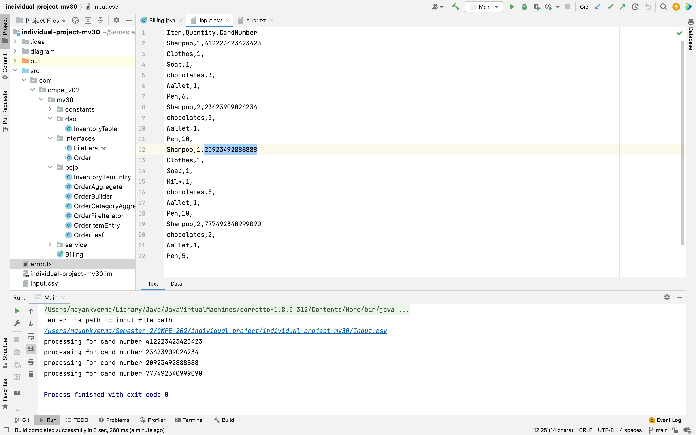
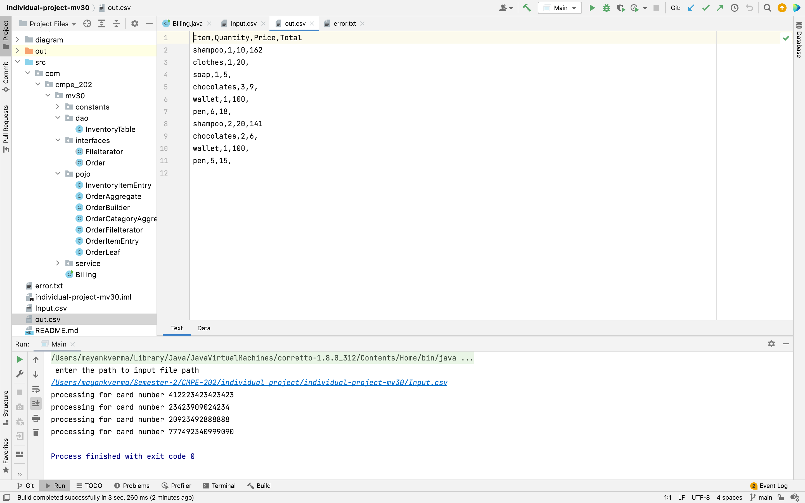
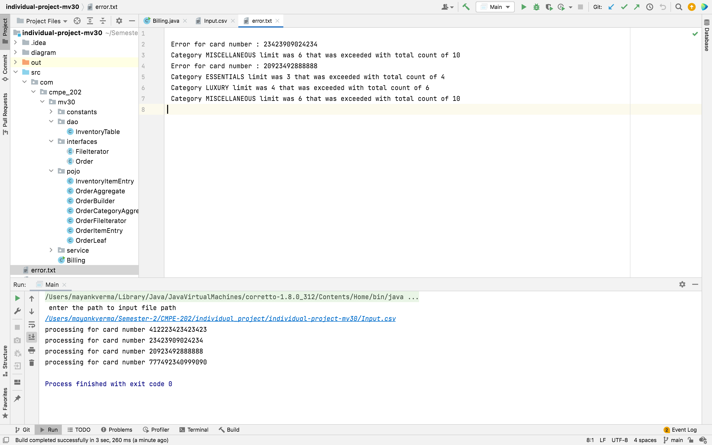

# CMPE 202 Individual project

<h3>Class Diagram</h3>


<h3>Design Patterns used</h3>

#### Singleton Pattern
```
Since the access to the inventory database needs to be in a synchornized manner to 
avoid inconsistencies. Singleton design pattern was used to acheive the same. 
The participating class is InventoryTable 
```


#### Composite Pattern
```
Any order can can be orgainsed into a whole part hierarchy depending on the various
subcategories. To capture that composite design pattern was used. The participating 
classes were Order(abstract class), OrderAggregate for internal nodes & Order Leaf 
for leaf nodes. 
```

#### Builder Pattern
```
For creating order hierarchy with individual orders as customisation Builder pattern
was used. The participating classes are OrderBuilder as the builder class & Order 
as object being created class.
```

#### Iterator Pattern
```
To iterate over orders one by one on reading the input file completely agnostic to the 
the format in the input file iterator pattern was used. Participating classes are  FileIterator
abstract class & OrderFileIterator as iterator implementation. As the aggregate in this was a file
so no special classes was dedicate for it.
```

<h3>Output</h3>

### Input file


### Output file


### Error file

